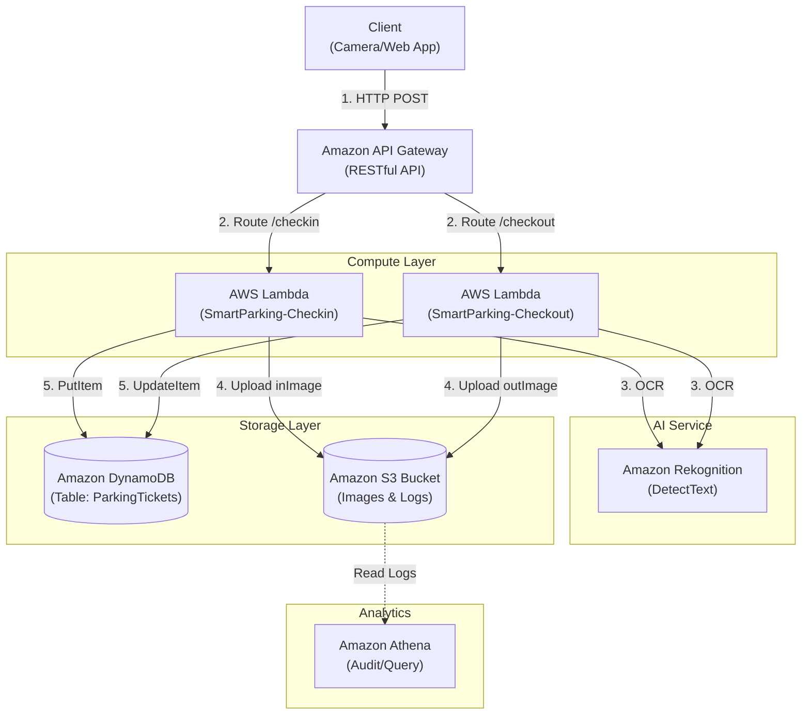
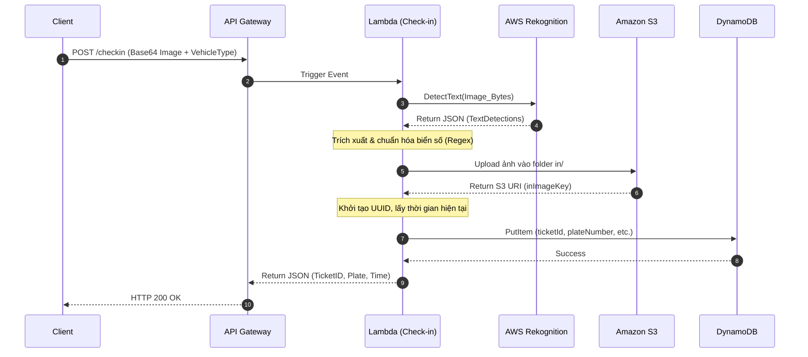

# THIẾT KẾ KIẾN TRÚC HỆ THỐNG - SMART PARKING

Tài liệu này mô tả chi tiết kiến trúc Serverless trên AWS, luồng dữ liệu (Data Flow) và cấu trúc cơ sở dữ liệu (Database Schema) cho hệ thống quản lý bãi giữ xe thông minh.

---

## 1. SƠ ĐỒ KIẾN TRÚC TỔNG THỂ (SERVERLESS ARCHITECTURE)

Hệ thống sử dụng hoàn toàn các dịch vụ Serverless của AWS để đảm bảo khả năng tự mở rộng, tiết kiệm chi phí (chỉ trả tiền khi sử dụng) và dễ dàng triển khai trong môi trường AWS Learner Lab.



---

## 2. LUỒNG DỮ LIỆU (DATA FLOW DIAGRAM)

Dưới đây là kịch bản luồng dữ liệu cho quá trình **Check-in (Xe vào)**. Quá trình Check-out diễn ra tương tự nhưng thêm bước tính toán phí gửi xe.



---

## 3. THIẾT KẾ CƠ SỞ DỮ LIỆU (DATABASE SCHEMA)

Hệ thống sử dụng **Amazon DynamoDB**, một cơ sở dữ liệu NoSQL, với bảng `ParkingTickets` để lưu trữ thông tin các lượt xe ra vào.

- **Table Name:** `ParkingTickets`
- **Partition Key (PK):** `ticketId` (Kiểu String)
- **Billing Mode:** On-Demand (Tránh tốn chi phí rảnh rỗi trong Lab)

### Các thuộc tính (Attributes) trong bảng:

| Tên trường (Attribute) | Kiểu dữ liệu | Mô tả chi tiết |
| :--- | :--- | :--- |
| **`ticketId`** (PK) | String | Mã vé gửi xe duy nhất (Được tạo bằng UUID v4). |
| **`plateNumber`** | String | Biển số xe đã được chuẩn hóa (Ví dụ: `59X112345`). |
| **`vehicleType`** | String | Loại phương tiện: `MOTORBIKE` (Xe máy) hoặc `CAR` (Ô tô). |
| **`checkinTime`** | String | Thời gian xe vào bãi (Định dạng chuẩn ISO 8601: `YYYY-MM-DDTHH:mm:ssZ`). |
| **`checkoutTime`** | String | Thời gian xe ra khỏi bãi (Sẽ được cập nhật lúc check-out). |
| **`status`** | String | Trạng thái lượt gửi. Chỉ nhận 2 giá trị: `PARKED` (Đang đỗ) hoặc `COMPLETED` (Đã lấy xe). |
| **`fee`** | Number | Phí gửi xe (VNĐ), được tính toán lúc xe ra. Khi xe mới vào (Check-in) mặc định là `0`. |
| **`inImageKey`** | String | Đường dẫn/Key của ảnh chụp xe lúc vào được lưu trên S3 (Ví dụ: `in/2026-10-10/ticket_123.jpg`). |
| **`outImageKey`** | String | Đường dẫn/Key của ảnh chụp xe lúc ra lưu trên S3. |

### Ví dụ 1 Record (Item) hoàn chỉnh:

```json
{
  "ticketId": "f47ac10b-58cc-4372-a567-0e02b2c3d479",
  "plateNumber": "51A12345",
  "vehicleType": "CAR",
  "checkinTime": "2026-10-10T08:30:00Z",
  "checkoutTime": "2026-10-10T10:45:00Z",
  "status": "COMPLETED",
  "fee": 40000,
  "inImageKey": "in/2026-10-10/f47ac10b.jpg",
  "outImageKey": "out/2026-10-10/f47ac10b.jpg"
}
```
